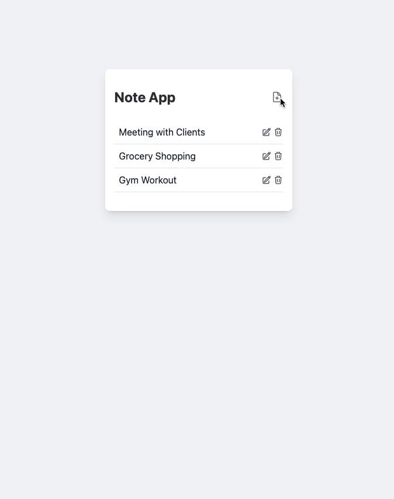

# Note App Code Challenge

# Challenge Description

This is a simple Note App that allows you to add, edit, and remove notes. However, there are currently some issues.

Your task is to figure out why the issues exist and fix them!

## Requirements

- Fix the bug in the application causing the page to reload when adding or editing notes

- Fix the bug in the application causing the title and content in the Note Modal to remain unchanged whenever the component's info prop changes.

> 💡 HINT: The info prop is changed whenever you save a new note. Opening the Note Modal after saving a new note should have the title and content values cleared. Likewise, clicking edit on any existing note should show it's title and content in the Note Modal.

- Do NOT rename any existing variables

> 💡 HINT: Both bugs exist in `NoteModal.vue`

## Other Considerations

- If you see the `data-test` attribute in the boilerplate don't remove it. If you remove it, your code may be invalid for the certificate.
